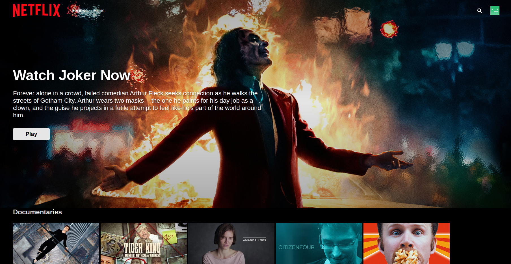

# Netflix-V2

> A netflix clone with full authentication && authorization using react, firebas, styled-components ,jest and compound components design pattern,and have unit tests with full code coverage using jest & react testing library

[live]: https://netflix-ahmedmaher-v2.vercel.app/

cle
 

## tools

- react
- firebase (auth/firestore)
- styled-components
- fuse
- jest
- react-context
- react-router-dom

## features

- login-logout
- play trailer for each film/series (one video)
- switch between two types films / series with four categories
- data is stored in fireStore
- full responsive
- full code coverage in testing

[MIT](./LICENSE.md)
